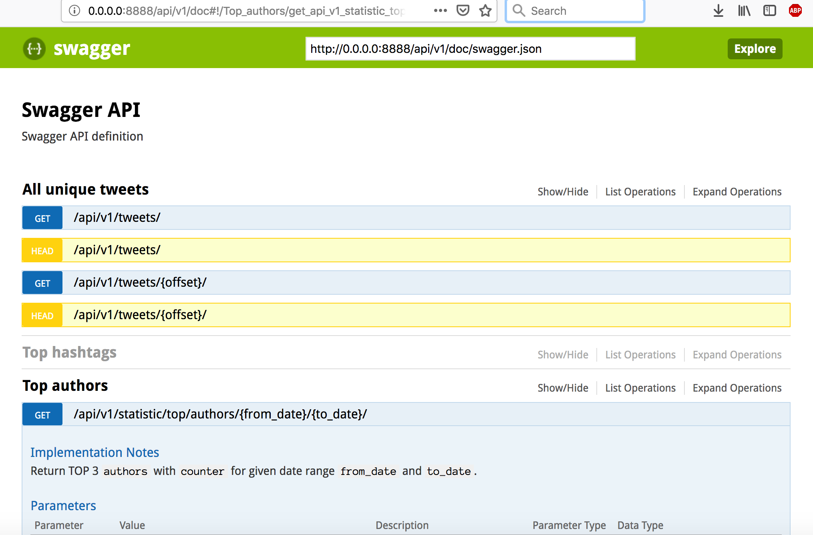
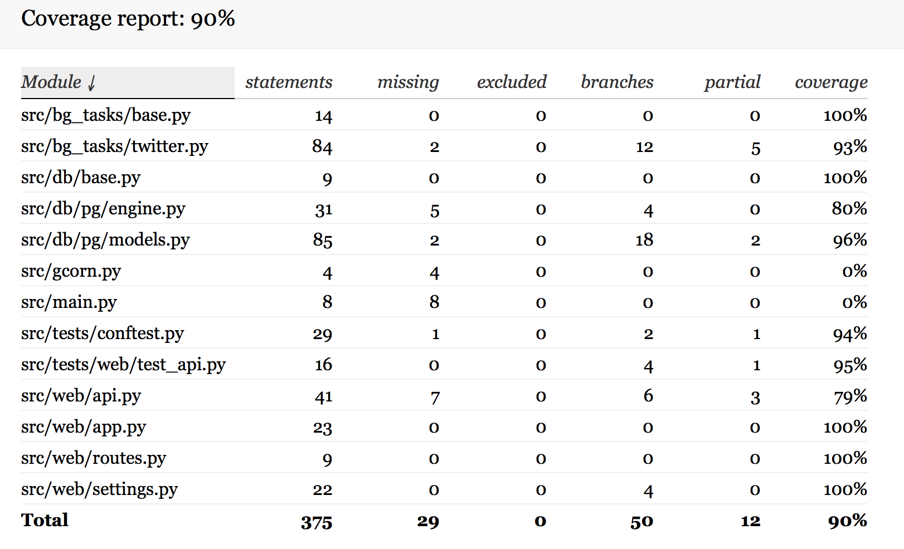

# Social network
**Specification**
* Get **last K tweets** queried by **specific phrase** once in a configured period of time (**N**) 
* API for unique tweets 
* API for statistic for each queried phrase for a given period of time:
	* top 3 hashtags found in tweets
	* top 3 users that made max amount of tweets
	* amount of analyzed tweets

**System design:**
* Lite task with long I/O bound  `asyncio/aiohttp`. We can choose `Celery + Celery.beat + MongoDB/Redis/RabbitMQ` (as broker) for asynchronous `distributed ` tasks queue/job.
* Database store `PostgreSQL`, but for complexes analytics it would be better solutions like time series database `TSDB`
* For improvement aggregating statistic apply 
	* **Summarizing Data** techniques per day (`partitions`) more in file `sql/init.sql` 
	* and `upsert` PG SQL command.

**System requirements:**
* make --version
>= GNU Make 3.81
* docker --version
>= Docker version 19.03.1, build 74b1e89
* docker-compose --version
>= docker-compose version 1.24.1, build 4667896b

**Setup application**
Edit files with `ENV vars`:
* `app.env`
* `postgres.env`

**Run application**
```bash
make
```
Help for Makefile
```bash
make help
```
Coding
```bash
make format
make check
```

**API doc link**
http://localhost:8888/api/v1/doc





*App server down*
```bash
make
make log
```
PG need some time for bootstrap.


**TODO:**
* More tests
* Build documentation
* Optimisation
* setup.py, `wait for` PG
* Production deploy with (Nginx + gunicorn + uvloop)
* Cache for API (Redis)
* Other  drivers (MongoDB)
* And more …
